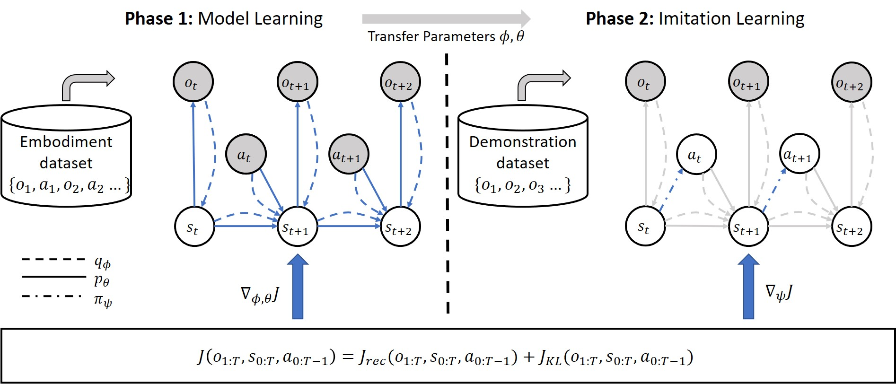

*This repository is published and maintained by the Volkswagen Group Machine Learning Research Lab.*

*Learn more at https://argmax.ai.*

## AIME 

This repository contains the original implementation of [AIME](https://openreview.net/forum?id=WjlCQxpuxU) in PyTorch.



If you find this code useful, please reference in your paper:
```BibTeX
@inproceedings{
zhang2023aime,
title={Action Inference by Maximising Evidence: Zero-Shot Imitation from Observation with World Models},
author={Xingyuan Zhang and Philip Becker-Ehmck and Patrick van der Smagt and Maximilian Karl},
booktitle={Thirty-seventh Conference on Neural Information Processing Systems},
year={2023},
url={https://openreview.net/forum?id=WjlCQxpuxU}
}
```

## Setup
```
conda create -n aime python=3.9
conda activate aime
conda install pytorch==2.0.0 torchvision==0.15.0 torchaudio==2.0.0 pytorch-cuda=11.7 -c pytorch -c nvidia
pip install -r requirements.txt
pip install -e .
```

## Structure
All the datasets should be placed under `datasets/` and the pretrained models should be placed under `pretrained-models/`. 
Results will be placed under `logs/`, which you can view by tensorboard.

## Download the datasets and pre-trained models
The datasets and pretrained models can be access from [Github Release](https://github.com/argmax-ai/aime/releases/latest). All the datasets and models are released under a [_CC BY 4.0 license_](https://creativecommons.org/licenses/by/4.0/). For more details, please check out the [Data Card](datasets/readme.md) and [Model Card](pretrained-models/readme.md).

For datasets, you need to extract it to `datasets/` folder by
```
tar -xzvf <.tgz file> -C datasets/
```

To generate the `walker-mix` dataset, please download all the walker datasets and then run the following command:

```
python scripts/mix_datasets.py -i walker-random walker-plan2explore-buffer walker-stand-buffer walker-walk-buffer -o walker-mix
```

For pretrain models, you need to extract it to `pretrained-models/` folder by
```
tar -xzvf pretrained-models.tgz -C pretrained-models/
```

## Usage

### General
- The supported environments can be found in `aime/configs/env/`, and supported tasks are listed in each individual environment file under the `supported_tasks`.
- We support `environment_setup` to be chose from `mdp`, `lpomdp` and `visual`.
- `dataset_name` is referring to a folder under the `datasets/` folder. 
- `model_name` is referring to a folder under the `pretrained-models/` folder.

### AIME

#### Train the dreamer agent

```
python scripts/train_dreamer.py env=<env_name> env.task=<task_name> environment_setup=<environment_setup>
```

*example:*

```
python scripts/train_dreamer.py env=walker env.task=walk environment_setup=visual
```

#### Train the plan2explore agent

```
python scripts/train_plan2explore.py env=<env_name> environment_setup=<environment_setup>
```

*example:*

```
python scripts/train_plan2explore.py env=walker environment_setup=visual
```

#### Train world model from a dataset (Phase 1 in AIME)
```
python scripts/train_model_only.py env=<env_name> environment_setup=<environment_setup> embodiment_dataset_name=<dataset_name>
```

*example:*

```
python scripts/train_model_only.py env=walker environment_setup=visual embodiment_dataset_name=walker-mix
```

#### Train AIME for imitation (Phase 2 in AIME)

```
python scripts/train_aime.py env=<env_name> env.task=<task> environment_setup=<environment_setup> model_name=<model_name> demonstration_dataset_name=<dataset_name> world_model.free_nats=0.0 world_model.kl_rebalance=null
```

*example:*

```
python scripts/train_aime.py env=walker env.task=run environment_setup=visual model_name=walker-mix-visual demonstration_dataset_name=walker-run-expert world_model.free_nats=0.0 world_model.kl_rebalance=null world_model=rssm
```

Optional:
- pass `kl_only=True` to train with only the KL term.
- pass `world_model.kl_scale=0.0` to train with only reconstruction term.
- pass `use_idm=True` to use IDM as guidence, see Appendix C for details.

### Baselines

#### BC

```
python scripts/train_bc.py env=<env_name> env.task=<task> environment_setup=<environment_setup> demonstration_dataset_name=<dataset_name>
```

*example:*

```
python scripts/train_bc.py env=walker env.task=run environment_setup=mdp demonstration_dataset_name=walker-walk-expert
```

#### BCO

```
python scripts/train_bco.py env=<env_name> env.task=<task> environment_setup=<environment_setup> embodiment_dataset_name=<embodiment_dataset_name> demonstration_dataset_name=<demonstration_dataset_name>
```

*example:*

```
python scripts/train_bco.py env=walker env.task=run environment_setup=mdp embodiment_dataset_name=walker-mix demonstration_dataset_name=walker-run-expert
```

#### IIDM
```
python scripts/train_iidm.py env=<env_name> env.task=<task> environment_setup=<environment_setup> embodiment_dataset_name=<embodiment_dataset_name> demonstration_dataset_name=<demonstration_dataset_name>
```

*example:*
```
python scripts/train_iidm.py env=walker env.task=run environment_setup=mdp embodiment_dataset_name=walker-mix demonstration_dataset_name=walker-run-expert
```

### NOTE:
- If you are using the pretrained models that we published, please make sure you use `world_model=rssm` for the Walker models, and `world_model=rssmo` for the Cheetah models.

## Results
The normalised scores used in the paper is offered as json files in the `results` folder and the expert performace that was used to normalised the scores can be accessed with `from aime.utils import EXPERT_PERFORMANCE`. For each setup, the policy interacts with the environment for 100 trajectories and report the results. Feel free to compare or analyze these results in your works.

## Disclaimer

The purpose of this source code is limited to bare demonstration of the experimental section of the related papers.
